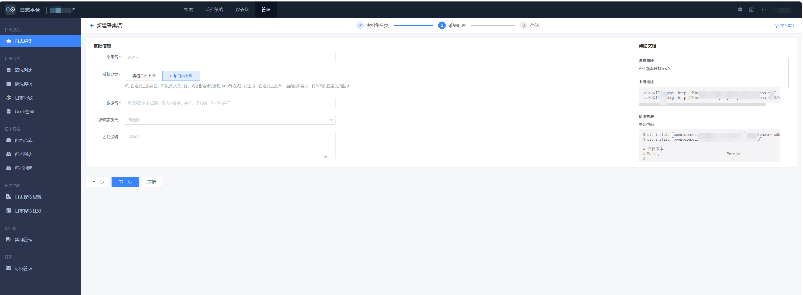
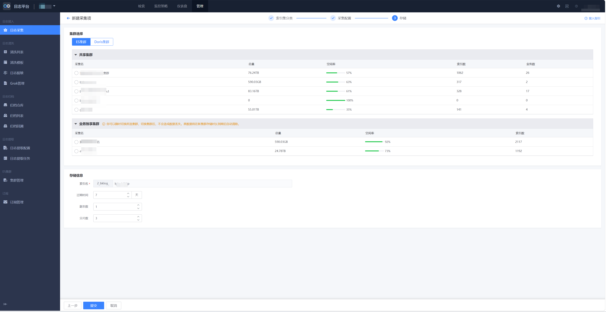

# 自定义日志 HTTP 上报

## 1. 概述

自定义日志 HTTP 上报用于将业务应用、容器或其他系统产生的日志接入日志平台。日志可以通过 OTLP/HTTP 协议上报，也可以通过采集器完成容器日志接入。

HTTP 上报适合应用侧主动发送日志的场景。容器日志采集适合已有标准输出、日志文件或容器运行环境的场景。

## 2. 准备开始

### 2.1 新建自定义日志

自定义日志上报前，需要先在页面创建自定义日志数据源，并完成基础信息和存储设置。

| 基础信息 | 存储设置 |
| --- | --- |
|  |  |

基础信息包括：

* 采集名：当前日志数据源的名称。
* 数据分类：日志所属分类。
* 数据名：日志数据源标识。
* 所属索引集：日志入库后用于检索的索引集。

存储设置包括：

* 存储集群：支持共享集群；如有业务独享集群，可以选择独享集群。
* 数据链路：选择已有数据链路进行日志上报。
* 存储参数：配置日志过期时间、副本数和分片数。

### 2.2 上报速率限制

OTLP 日志上报注意 API 频率限制 50,000 条/s。

如超过频率限制，请联系`蓝鲸助手`调整。

### 2.3 数据协议

OTLP/HTTP 日志上报使用 HTTP POST 请求。默认日志上报路径为 `/v1/logs`，请求体为 `ExportLogsServiceRequest`。

关键上报配置：

| 配置 | 必填 | 说明 |
| --- | --- | --- |
| `API_URL` | 是 | ❗❗【非常重要】日志上报接口地址（`Access URL`），请根据页面接入指引填写；如果页面提供的是 OTLP HTTP Endpoint 根地址，请在末尾追加 `/v1/logs`。 |
| `TOKEN` | 是 | ❗❗【非常重要】日志数据源 Token，上报时必须通过 `x-bk-token` Header 传递。 |

请求 Header：

| Header | 必填 | 说明 |
| --- | --- | --- |
| `Content-Type: application/json` | 是 | 使用 OTLP JSON Protobuf 编码。 |
| `x-bk-token: <TOKEN>` | 是 | ❗❗【非常重要】认证令牌，用于接口鉴权。缺少或填错时，日志无法正常上报。 |

`ExportLogsServiceRequest`：

| 字段 | 类型 | 必填 | 说明 |
| --- | --- | --- | --- |
| `resourceLogs` | `array<ResourceLog>` | 是 | 按资源分组的日志集合。 |

`ResourceLog`：

| 字段 | 类型 | 必填 | 说明 |
| --- | --- | --- | --- |
| `resource` | `Resource` | 否 | 产生日志的实体，例如服务、容器、Pod 或进程。 |
| `scopeLogs` | `array<ScopeLog>` | 是 | 按 instrumentation scope 分组的日志集合。 |
| `schemaUrl` | `string` | 否 | `resource` 使用的 schema 地址。 |

`Resource`：

| 字段 | 类型 | 必填 | 说明 |
| --- | --- | --- | --- |
| `attributes` | `array<KeyValue>` | 否 | 资源属性，例如服务名、环境、Pod 名称。 |
| `droppedAttributesCount` | `integer` | 否 | 被丢弃的资源属性数量，通常不用主动设置。 |

`ScopeLog`：

| 字段 | 类型 | 必填 | 说明 |
| --- | --- | --- | --- |
| `scope` | `InstrumentationScope` | 否 | 产生日志的库、模块或 logger 信息。 |
| `logRecords` | `array<LogRecord>` | 是 | 实际日志记录列表。 |
| `schemaUrl` | `string` | 否 | `scope` 和 `logRecords` 使用的 schema 地址。 |

`InstrumentationScope`：

| 字段 | 类型 | 必填 | 说明 |
| --- | --- | --- | --- |
| `name` | `string` | 否 | 产生日志的库、模块或 logger 名称。 |
| `version` | `string` | 否 | 产生日志的库、模块或 logger 版本。 |
| `attributes` | `array<KeyValue>` | 否 | scope 级别的附加属性。 |
| `droppedAttributesCount` | `integer` | 否 | 被丢弃的 scope 属性数量。 |

`LogRecord`：

| 字段 | 类型 | 必填 | 说明 |
| --- | --- | --- | --- |
| `timeUnixNano` | `string` | 否 | 日志发生时间，Unix 纳秒时间戳。OTLP JSON 中 `fixed64` 使用字符串表达。 |
| `observedTimeUnixNano` | `string` | 否 | 日志被采集系统观测到的时间。 |
| `severityNumber` | `integer` | 否 | 标准化日志级别数值。 |
| `severityText` | `string` | 否 | 原始日志级别文本，例如 `INFO`、`WARN`、`ERROR`。 |
| `body` | `AnyValue` | 否 | 日志正文，可以是字符串或结构化对象。 |
| `attributes` | `array<KeyValue>` | 否 | 当前日志事件的附加属性。 |
| `droppedAttributesCount` | `integer` | 否 | 被丢弃的日志属性数量。 |
| `flags` | `integer` | 否 | Trace flags。低 `8` 位对应 W3C Trace Context flags。 |
| `traceId` | `string` | 否 | Trace ID，OTLP JSON 中使用十六进制字符串。 |
| `spanId` | `string` | 否 | Span ID，OTLP JSON 中使用十六进制字符串。 |
| `eventName` | `string` | 否 | 事件类型名称，适合结构化事件日志。 |

`KeyValue`：

| 字段 | 类型 | 必填 | 说明 |
| --- | --- | --- | --- |
| `key` | `string` | 是 | 属性名，同一组属性内应保持唯一。 |
| `value` | `AnyValue` | 是 | 属性值。 |

`AnyValue`：

| 字段 | 类型 | 必填 | 说明 |
| --- | --- | --- | --- |
| `stringValue` | `string` | 否 | 字符串值。 |
| `boolValue` | `boolean` | 否 | 布尔值。 |
| `intValue` | `string` | 否 | 整数值。OTLP JSON 中 `int64` 使用字符串表达。 |
| `doubleValue` | `number` | 否 | 浮点数值。 |
| `arrayValue` | `object` | 否 | 数组值，结构为 `{ "values": [AnyValue] }`。 |
| `kvlistValue` | `object` | 否 | 对象值，结构为 `{ "values": [KeyValue] }`。 |
| `bytesValue` | `string` | 否 | 字节值，按 Protobuf JSON 规则编码。 |

```shell
#!/bin/bash
# ❗❗【非常重要】认证令牌，用于接口鉴权，请替换为页面提供的日志数据源 Token。
TOKEN="fixme"

# ❗❗【非常重要】上报地址，国内站点默认是「http://127.0.0.1:4318/v1/logs」，其他环境、跨云场景请根据页面接入指引填写。
API_URL="http://127.0.0.1:4318/v1/logs"

TIME_UNIX_NANO="$(($(date +%s) * 1000000000))"

REPORT_DATA=$(cat <<EOF
{
  "resourceLogs": [
    {
      "resource": {
        "attributes": [
          { "key": "service.name", "value": { "stringValue": "custom-log-demo" } },
          { "key": "deployment.environment.name", "value": { "stringValue": "local" } }
        ]
      },
      "scopeLogs": [
        {
          "scope": { "name": "curl-demo" },
          "logRecords": [
            {
              "timeUnixNano": "${TIME_UNIX_NANO}",
              "severityNumber": 9,
              "severityText": "INFO",
              "body": { "stringValue": "custom log http report demo" },
              "attributes": [
                { "key": "demo.source", "value": { "stringValue": "curl" } }
              ]
            }
          ]
        }
      ]
    }
  ]
}
EOF
)

curl -sS -X POST "${API_URL}" \
  -H "Content-Type: application/json" \
  -H "x-bk-token: ${TOKEN}" \
  -d "${REPORT_DATA}"
```

#### 2.3.1 Resources

Resources 代表负责生成日志数据的实体，这些实体作为资源属性被记录下来。例如，一个在 Kubernetes 容器中的进程可能有服务名、命名空间、Pod 名称和容器名称等属性。

常见 Resources 字段：

* `service.name`：服务唯一标识，一个应用可以有多个服务，通过该属性区分。

* `deployment.environment.name`：部署环境，例如 `prod`、`staging`。

* `k8s.pod.name`：Kubernetes Pod 名称，用于定位具体运行实例。

参考：<a href="https://opentelemetry.io/docs/concepts/resources/" target="_blank">OpenTelemetry Resources</a>。

#### 2.3.2 Attributes

Attributes 是某条日志事件自身的附加信息，适合记录请求方法、接口路径、错误类型、业务 ID 等会随日志事件变化的字段。

Resources 描述“谁产生日志”，Attributes 描述“这条日志发生了什么”。

参考：<a href="https://opentelemetry.io/docs/specs/otel/logs/data-model/#field-attributes" target="_blank">OpenTelemetry Logs Data Model - Attributes</a>。

#### 2.3.3 severityNumber

`severityNumber` 是 OpenTelemetry 对日志级别的标准化数值。数值越大，日志越严重。

| 范围 | 名称 | 含义 |
| --- | --- | --- |
| `0` | UNSPECIFIED | 未指定级别。 |
| `1`～`4` | TRACE | 细粒度调试事件。 |
| `5`～`8` | DEBUG | 调试事件。 |
| `9`～`12` | INFO | 普通信息事件。 |
| `13`～`16` | WARN | 警告事件。 |
| `17`～`20` | ERROR | 错误事件。 |
| `21`～`24` | FATAL | 致命错误。 |

参考：<a href="https://opentelemetry.io/docs/specs/otel/logs/data-model/#field-severitynumber" target="_blank">OpenTelemetry Logs Data Model - SeverityNumber</a>。

#### 2.3.4 TraceID & SpanID

`traceId` 和 `spanId` 用于把日志与链路追踪关联起来。请求处理过程中产生的日志建议带上这两个字段，这样排查问题时可以从日志跳转到 Trace，或从 Trace 定位相关日志。

参考：<a href="https://opentelemetry.io/docs/specs/otel/logs/data-model/#trace-context-fields" target="_blank">OpenTelemetry Logs Data Model - Trace Context Fields</a>。

## 3. 快速接入

### 3.1 数据上报示例

* 了解 <a href="https://github.com/TencentBlueKing/bkmonitor-ecosystem/blob/master/docs/open/cookbook/Quickstarts/logs/http/python.md" target="_blank">Python-日志（HTTP）上报</a>。

* 了解 <a href="https://github.com/TencentBlueKing/bkmonitor-ecosystem/blob/master/docs/open/cookbook/Quickstarts/logs/http/cpp.md" target="_blank">C++-日志（HTTP）上报</a>。

* 了解 <a href="https://github.com/TencentBlueKing/bkmonitor-ecosystem/blob/master/docs/open/cookbook/Quickstarts/logs/http/java.md" target="_blank">Java-日志（HTTP）上报</a>。

* 了解 <a href="https://github.com/TencentBlueKing/bkmonitor-ecosystem/blob/master/docs/open/cookbook/Quickstarts/logs/http/go.md" target="_blank">Go-日志（HTTP）上报</a>。

另一种方式是通过 SDK 上报自定义日志：

* 了解 <a href="https://github.com/TencentBlueKing/bkmonitor-ecosystem/blob/master/docs/open/cookbook/Quickstarts/logs/sdks/python.md" target="_blank">Python-日志（SDK）上报</a>。

* 了解 <a href="https://github.com/TencentBlueKing/bkmonitor-ecosystem/blob/master/docs/open/cookbook/Quickstarts/logs/sdks/cpp.md" target="_blank">C++-日志（SDK）上报</a>。

* 了解 <a href="https://github.com/TencentBlueKing/bkmonitor-ecosystem/blob/master/docs/open/cookbook/Quickstarts/logs/sdks/java.md" target="_blank">Java-日志（SDK）上报</a>。

* 了解 <a href="https://github.com/TencentBlueKing/bkmonitor-ecosystem/blob/master/docs/open/cookbook/Quickstarts/logs/sdks/go.md" target="_blank">Go-日志（SDK）上报</a>。

### 3.2 查看数据

日志上报后，可以在对应索引集或日志检索页面查看数据。

如短时间内没有看到数据，请先确认以下信息：

* `TOKEN` 是否为当前日志数据源的 Token。

* `API_URL` 是否为页面接入指引提供的上报地址，OTLP HTTP 上报需要使用 `/v1/logs` 路径。

* `timeUnixNano` 是否为当前时间附近的纳秒时间戳。

* `service.name`、索引集和数据链路是否与页面配置一致。

## 4. 常见问题

### 4.1 FAQ

#### 4.1.1 HTTP 返回成功后，为什么页面没有看到日志？

Q：请求返回成功，为什么页面没有看到日志？

A：HTTP 成功只代表接收侧已处理请求，不等于数据已经完成入库和索引刷新。请等待一段时间后重试，并检查 `TOKEN`、`API_URL`、数据链路、索引集和日志时间字段。

#### 4.1.2 什么时候用 Resources，什么时候用 Attributes？

Q：Resources 和 Attributes 都能放字段，应该怎么选择？

A：描述产生日志的实体时放到 Resources，例如服务名、环境、Pod 名称。描述某条日志事件本身时放到 Attributes，例如接口路径、请求方法、异常类型。

### 4.2 更多问题

* <a href="#" target="_blank">自定义日志无数据</a>。

## 5. 了解更多

进一步了解以下内容：

* 进行 <a href="#" target="_blank">日志检索</a>。

* 了解 <a href="#" target="_blank">容器日志自定义上报使用文档</a>。

* 了解 <a href="#" target="_blank">容器日志采集器安装</a>。